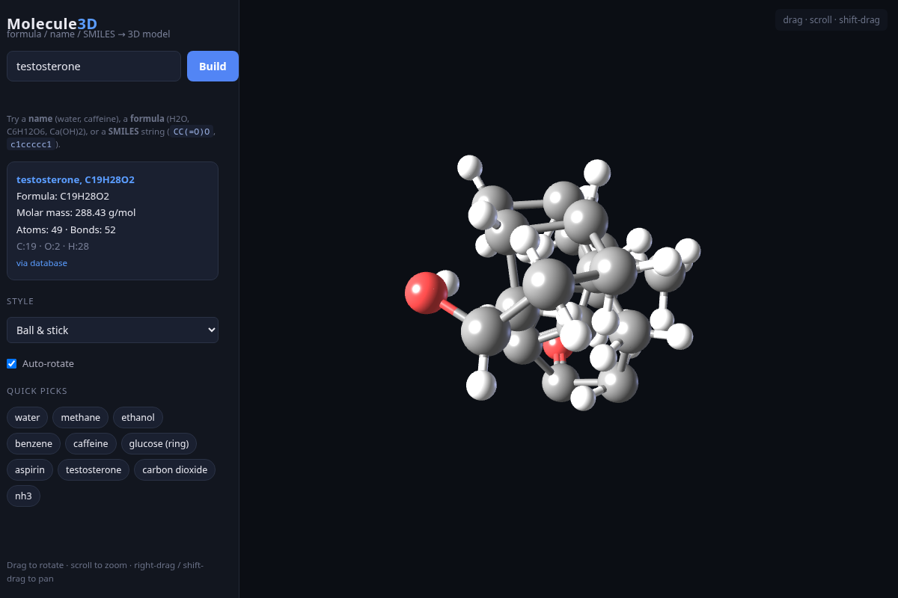

# Molecule3D

Build 3D models of organic molecules from a name, a molecular formula, or a
SMILES string. Fully client-side: no build step, no server, no dependencies
beyond a local copy of three.js.

## Run

Open index.html in any modern browser, or serve the folder:

    cd molecule3d
    python3 -m http.server 8000
    # visit http://localhost:8000

(Opening index.html directly from disk also works - no fetches are made.)

## Input formats

| Input   | Example              | Behavior                                                                 |
|---------|----------------------|--------------------------------------------------------------------------|
| Name    | caffeine, water      | Looked up in the built-in database (~40 molecules)                       |
| Formula | H2O, C6H12O6, Ca(OH)2| Unique small molecules built from a template; otherwise composition shown|
| SMILES  | CC(=O)O, c1ccccc1    | Parsed directly - any molecule in the organic SMILES subset works        |

## How it works

- js/core.js - element data, formula parser (with parentheses), SMILES parser
  (branches, rings, double/triple/aromatic bonds), implicit-hydrogen assignment,
  Kekule conversion of aromatic rings.
- js/geometry.js - seeds 3D coordinates via depth-first placement with ideal
  bond angles (sp 180, sp2 120, sp3 109.5), then relaxes them with a small
  force field (harmonic bonds, 1-3 angle terms, nonbonded repulsion).
- js/viewer.js - three.js rendering: ball-and-stick, space-fill (CPK), and
  wireframe styles, with orbit / pan / zoom controls built from scratch.
